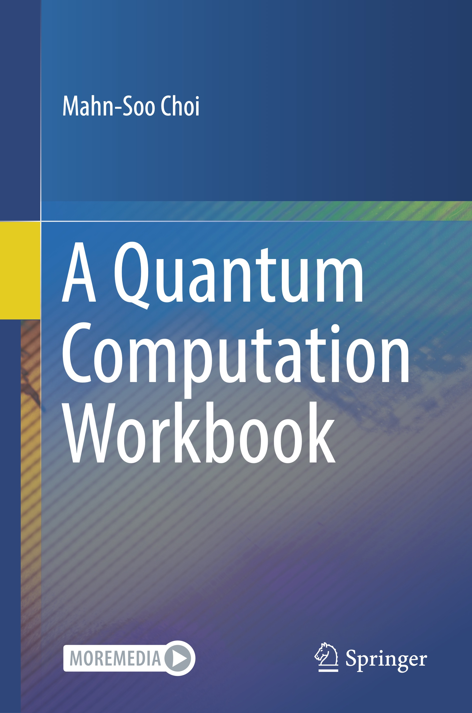

# A Quantum Playbook

This package contains two compilations of Mathematica(R) demonstrations. The first, Workbook Demonstrations, includes all demonstrations in ["A Quantum Computation Workbook" (Springer, March 2022)](https://link.springer.com/book/9783030912130). The other, Playbook Demonstrations, is a collection of demonstrations of various topics in the field of *quantum information systems*, *quatum many-body systems*, and *quantum spin systems*. Users can try and modify the code themselves to build their own examples on the demonstrations and to experiment their fresh ideas.

The code in this package is based on Mathematica package [Q3](https://github.com/quantum-mob/Q3). [Q3](https://github.com/quantum-mob/Q3) consists of tools and utilities that perform symbolic calculations and numerical simulations useful in the study of quantum information processing, quantum many-body systems, and quantum spin systems. With [Q3](https://github.com/quantum-mob/Q3), one can avoid many of the tedious calculations involved in various principles and theorems of quantum theory. Furthermore, numerous visualization and simulation tools can help deepen the understanding of core concepts.

## Installation

QuantumPlaybook provides a *fully automatic installation and update*. Please take a look at the [Installation Guide](./INSTALL.md) for the instructions.

## Workbook Demonstrations

This is a compilation of the demonstrations in ["A Quantum Computation Workbook" (Springer, March 2022)](https://link.springer.com/book/9783030912130).

1. The Postulates of Quantum Mechanics
2. Quantum Computation: Overview ([Full text of Chapter 2 in PDF](./Samples/Chapter2.pdf))
3. Realizations of Quantum Computers
4. Quantum Algorithms
5. Quantum Decoherence
6. Quantum Error-Correction Codes
7. Quantum Information Theory
- Appendix A. Linear Algebra (available free of charge as Back Matter from the [Springer Link](https://link.springer.com/book/9783030912130))
- Appendix B. Superoperators (available free of charge as Back Matter from the [Springer Link](https://link.springer.com/book/9783030912130))
- Appendix C. Group Theory (available free of charge as Back Matter from the [Springer Link](https://link.springer.com/book/9783030912130))
- Appendix D. Mathematica Application Q3 (available free of charge as Back Matter from the [Springer Link](https://link.springer.com/book/9783030912130))
- Appendix E. Integrated Compilation of Demonstrations (available free of charge as Back Matter from the [Springer Link](https://link.springer.com/book/9783030912130))
- Appendix F. Solutions to Select Problems (available free of charge as Back Matter from the [Springer Link](https://link.springer.com/book/9783030912130))
- Bibliography (available free of charge as Back Matter from the [Springer Link](https://link.springer.com/book/9783030912130))
- Index (available free of charge as Back Matter from the [Springer Link](https://link.springer.com/book/9783030912130))
- [Errata](./Samples/Errata.pdf)

NOTE: All back materials including appendices, bibliography, and index in a single PDF file are available free of charge from the [Springer Link](https://link.springer.com/book/9783030912130).

## Playbook Demonstrations

Here is another compilation of demonstrations that have not been covered in detail or at all in ["A Quantum Computation Workbook" (Springer, March 2022)](https://link.springer.com/book/9783030912130). This includes a wide range of topics from the field of quantum information systems, quantum many-body systems, and quantum spin systems.

- Partial Trace: Physical Meaning
- Non-Unitary Dynamics of Quantum States
- Transposition as a Supermap
- Addition of Numbers
- Measurement of Total Pauli Z
- Entanglement Distillation
- Lambda-Matter in a Cavity
- Symmetry Effects on Quantum Master Equations
- Transmon: Quantum Phase Model
- And many others

## Demonstrations in YouTube Videos

## YouTube Video Tutorials of Q3

The tutorials of Q3 for beginners are also available in [YouTube videos](https://www.youtube.com/@QuantumWorkforceCenter/videos). The notebook files below contain the demonstrations shown in the corresponding videos.

## How to use

Once QuantumPlaybook is installed, put `QuantumPlaybook` in the search field of the Wolfram Documentation Center (Mathematica Help window). You will see the table of contents of the playbook.
